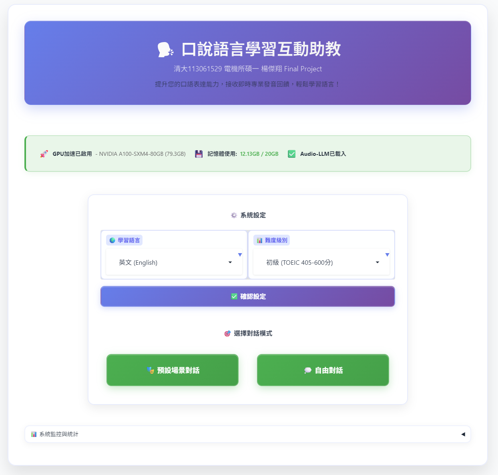
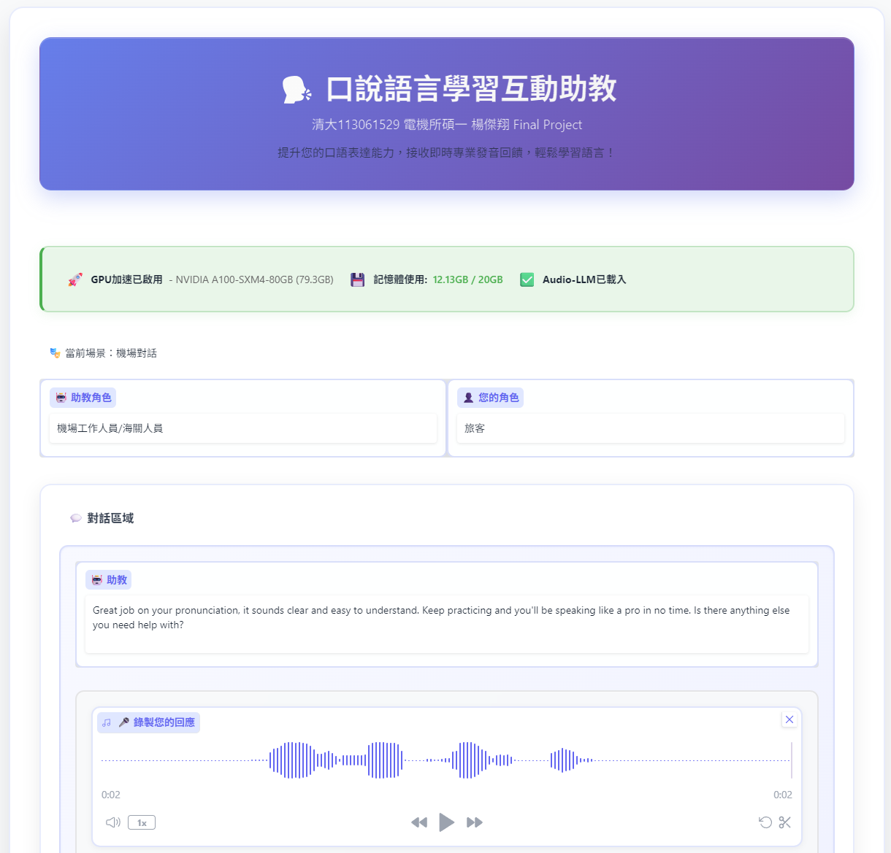
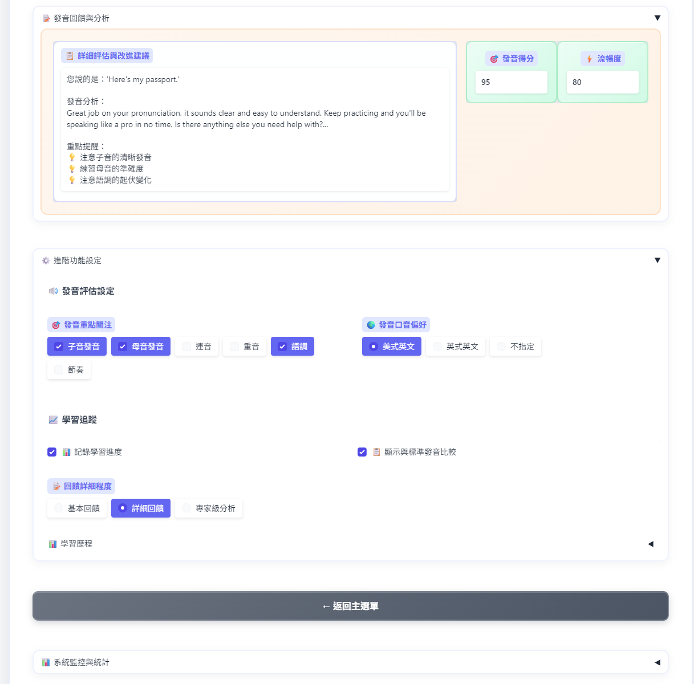
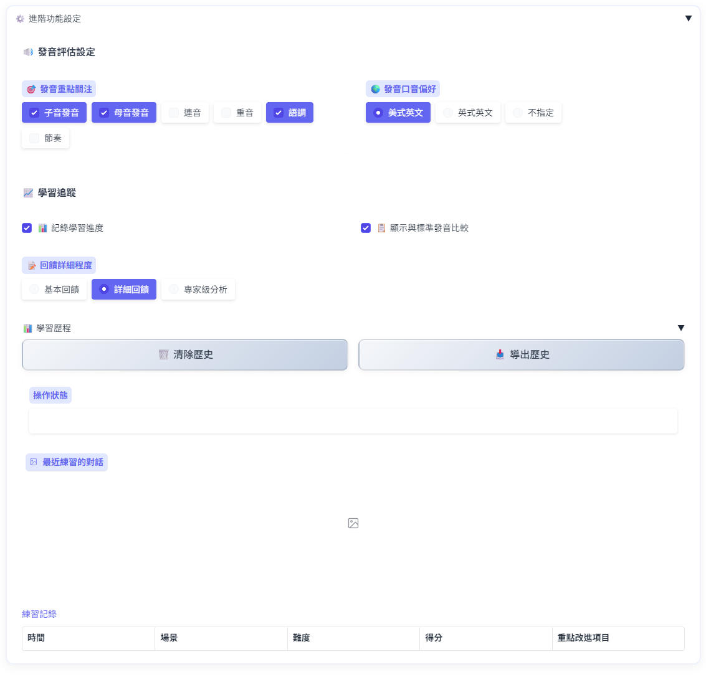

# 口說語言學習互動助教系統
## TAICA生成式AI課程期末專題報告

**學生資訊**
- **姓名**: 楊傑翔
- **學號**: 113061529
- **系所**: 國立清華大學電機工程學系碩士班
- **課程**: TAICA生成式AI：文字與圖像生成的原理與實務
- **GitHub**: https://github.com/Jie-shiang/Qwen2-audio-TAICA-FInal.git
- **Colab**: https://colab.research.google.com/drive/1lOXTTMYY521QtAjKdNYNB6YN6sXxkug0?usp=drive_link

---

## 1. 專案發想與問題定義

### 1.1 為什麼做這個專案？

說到語言學習，相信大家都有過在課堂上不敢開口、怕發音不標準被笑的經驗，自己在學英文的過程中也深刻體會到，要找一個能夠耐心聽你說話、給你即時回饋、其實不太容易，傳統的國高中的語言課程雖然有老師，但一堂課40個學生，每個人能說話的時間可能連5分鐘都不到，更別說得到個人化的發音指導。而且英文課或外語課的核心還是在對付考試，所以學生的讀寫能力還是比聽說更好，一般要練習口說就必須要特別請人來幫助練習，或嘗試其他app，市面上的語言學習App，像Duolingo這些，雖然很方便，但大多專注在文法和閱讀，真正針對「口說」這塊的訓練還是相對薄弱。而且可能還要付錢，早一點學習DL的時候，大部分都是LLM跟ASR model分開來講述，也分別學習他們的原理跟功能，LLM上課介紹的很多，這邊就不多提，ASR部分還是以Whisper為最優，近期model多往多模態去發展，其中也有出現ASR+LLM的audio-llm，最大的特點就是能"聽懂"語音，並做LLM相關的分析，於是我就想：能不能用現在這些強大的Model，做一個真正能夠幫助大家練習口說的智能助教呢？

### 1.2 想解決什麼問題？

簡單來說，我希望解決這幾個痛點：

1. **練習機會不夠**：想說英文的時候找不到人陪練
2. **回饋不夠專業**：不知道自己的發音哪裡有問題
3. **沒有個人化指導**：每個人的英文程度不同，需要的幫助也不一樣
4. **缺乏實際對話情境**：背單字很容易，但真正要用的時候就卡住了

---

## 2. 技術選擇與理由

### 2.1 為什麼選擇 Whisper？

OpenAI的Whisper是ASR領域最好的Model

核心的實現邏輯：

```python
def _load_whisper_model(self):
    if self.use_gpu:
        # 先嘗試載入medium模型
        self.whisper_model = whisper.load_model("medium").to(self.device)
        # 如果記憶體不夠，自動降級到base模型
        if not self._memory_check_and_cleanup("Whisper載入後"):
            del self.whisper_model
            self.whisper_model = whisper.load_model("base").to(self.device)
```

### 2.2 為什麼加入 Qwen2-Audio？

Qwen2-Audio不只是把語音轉成文字，它能夠「聽懂」你說話的語調、情感，甚至是發音的細節。

**直接音頻理解**：不需要先把語音轉文字再分析，而是直接從音頻中理解內容，這樣就能捕捉到很多傳統ASR錯過的信息，像是你說話時的語調是上升還是下降、有沒有重音等。

**上下文感知**：它能記住前面的對話內容，給出更自然的回應。

不過要跑起來不太容易，所以有一部分要注意在記憶體管理上：

```python
# 根據可用記憶體動態調整模型配置
if available_memory < 6:
    torch_dtype = torch.float32
    device_map = "cpu"  # 記憶體不夠就用CPU
elif available_memory < 10:
    torch_dtype = torch.float16
    device_map = {"": 0}  # 使用量化版本
else:
    torch_dtype = torch.float16
    device_map = "auto"  # 完整GPU模式
```

---

## 3. 系統架構設計

### 3.1 整體架構思考

```
用戶語音輸入 → Whisper語音識別 → 記憶體狀態檢查 
                                        ↓
個性化回應生成 ← 發音評估處理 ← Qwen2-Audio分析/簡化分析
                                        ↓
用戶界面展示 ← 回饋內容整合 ← 難度調整處理
```

### 3.2 模組化設計

整個系統分成四個主要模組：

**models.py**
整個系統的核心，負責管理Model的loading跟其他事情：

```python
class ModelManager:
    def __init__(self, gpu_memory_limit=20):
        self._setup_gpu()              # 先檢查GPU狀況
        self._start_memory_monitoring() # 啟動記憶體監控
        self._load_models()            # 載入模型
```

**processors.py**
實現了整個語音分析的核心邏輯，主要設計在System Prompt的生成系統：

```python
def create_advanced_prompt(scenario, difficulty, pronunciation_focus, 
                          accent_preference, feedback_detail, show_comparison):  
    # 根據難度調整AI的回應風格
    difficulty_config = DIFFICULTY_CONFIGS.get(difficulty)
    
    # 如果用戶想重點練習子音發音，AI就會特別注意這點
    if "子音發音" in pronunciation_focus:
        focus_areas.append("consonant clarity and accuracy")
        
    # 美式英文 vs 英式英文的不同評估標準
    if accent_preference == "美式英文":
        accent_instructions = """
        ACCENT TARGET: American English (General American)
        - Focus on rhotic 'r' sounds, flat 'a' in words like 'dance'
        """
```

**memory_monitor.py**
題外話:自從某時候開始，LLM就會開始吐這些emoji出來，看起挺溫馨，也比較好辨認那些是AI寫得，不過現在寫的其實都不錯

```python
def check_memory_usage(self):
    # 三層保護機制
    if memory_usage > 80%:
        print("⚠️ 記憶體使用警告")
        self.clear_gpu_memory()
    elif memory_usage > 90%:
        print("🚨 緊急記憶體清理")
        self.emergency_cleanup()
    elif memory_usage > 95%:
        print("💀 記憶體超限，保護性終止")
        self.force_kill_program()
```

**app.py**
跟課程一樣使用Gradio構建網頁界面。

### 3.3 System Prompt 的設計

傳統的語言學習系統給每個人同樣的回饋，所以要設計一個機制是audio-llm會根據每個學習者的需求產生不一樣的prompt。

一個初學者需要的是鼓勵和基本的發音指導，而一個高級學習者可能需要更細緻的語言學分析。

所以我設計了一個動態的System Prompt生成系統：

```python
# 針對不同難度級別的個性化設定
DIFFICULTY_CONFIGS = {
    "初學者 (TOEIC 250-400分)": {
        "evaluation_criteria": "Focus on basic pronunciation clarity",
        "encouragement_level": "very_encouraging",
        "score_adjustment": +15,
        "vocabulary_level": "basic"
    },
    "高級 (TOEIC 905+分)": {
        "evaluation_criteria": "Evaluate native-like fluency and sophisticated vocabulary",
        "encouragement_level": "detailed",
        "score_adjustment": -10,
        "vocabulary_level": "professional"
    }
}
```

```python
system_prompt = f"""
You are an airport staff member helping a {level} English learner.

PRONUNCIATION FOCUS AREAS:
- Pay special attention to: {', '.join(pronunciation_focus)}
- Provide specific feedback on these aspects

ACCENT TARGET: {accent_preference} pronunciation standards

FEEDBACK LEVEL: {feedback_detail}
- {"Provide simple, practical feedback" if feedback_detail == "基本回饋" else "Provide expert-level linguistic analysis"}

RESPONSE FORMAT:
**PRONUNCIATION ANALYSIS:**
[詳細的發音分析]

**CONVERSATION RESPONSE:**
[自然的對話回應]

**SUGGESTED NEXT RESPONSES:**
1. [基礎回應選項]
2. [中級回應選項] 
3. [進階回應選項]
"""
```

---

## 4. 核心功能實現

### 4.1 建議回覆句子功能

這個功能的靈感來自於自己學語言的經驗。很多時候我們能聽懂對方說什麼，但就是不知道該怎麼回應。所以我設計了一個「建議回覆句子」系統，讓AI不只分析你的發音，還會建議你下一句可以怎麼說。

```python
def _generate_suggested_responses(self, scenario, difficulty_config, user_text):
    """根據場景和難度生成分層建議"""
    level = difficulty_config["level"]
    
    # 機場對話的建議回覆範例
    if scenario == "機場對話 (Airport Conversation)":
        if level == "beginner":
            return [
                "Thank you. Here is my passport.",  # 基礎版本
                "I am here for vacation.",          # 簡單直接
                "I will stay for one week."         # 基本句型
            ]
        elif level == "advanced":
            return [
                "Certainly. Here are my passport and boarding pass.",
                "I'm here on a business trip with some leisure time.",
                "I'll be staying for approximately two weeks for both business and tourism."
            ]
```

### 4.2 多層次發音分析

系統提供兩套分析機制：

**詳細分析模式（Audio-LLM）**：
當GPU記憶體充足時，使用Qwen2-Audio進行深度分析，能夠檢測語調、節奏、情感等細微差別。

**簡化分析模式**：
當資源有限時，使用基於規則的算法進行基本評分，但仍然整合用戶的個性化設定。(簡單來說就是嘗試在Colab上跑會用到)

```python
def analyze_pronunciation(self, audio_path, transcribed_text, scenario, 
                         difficulty, pronunciation_focus, accent_preference):
    try:
        result = self._analyze_with_audio_llm(...)
        if result:
            return result
    except Exception:
        return self._analyze_with_simple_method(...)
```

### 4.3 場景導向對話系統

準備了六種常見的對話場景，每種場景都有不同的評估重點：

- **機場對話**：旅遊詞彙和基本溝通
- **餐廳點餐**：禮貌用語和服務互動
- **求職面試**：專業詞彙和正式表達
- **日常社交**：自然流暢度和慣用語
- **醫療諮詢**：關注症狀描述的準確性
- **學術討論**：學術詞彙和邏輯表達

每個場景都會根據用戶的難度級別提供不同複雜度的對話內容。

### 4.4 記憶體管理

(這部分是怕用太多實驗室資源所以生出來的)

```python
class MemoryMonitor:
    def monitor_loop(self):
        while self.monitoring:
            current_usage = self.get_gpu_memory_usage()
            
            if current_usage > self.limit * 0.8:
                print("🟡 記憶體使用警告，執行清理")
                self.emergency_cleanup()
            
            elif current_usage > self.limit * 0.9:
                print("🟠 記憶體使用過高，降級模式")
                self.switch_to_simplified_mode()
            
            elif current_usage > self.limit * 0.95:
                print("🔴 記憶體超限，保護性終止")
                self.graceful_shutdown()
```

---

## 5. 用戶體驗設計

### 5.1 界面設計

毛玻璃效果（backdrop-filter）和漸層色彩，讓整個界面看起來厲害一點：

```css
.main-container {
    background: rgba(255, 255, 255, 0.98);
    backdrop-filter: blur(15px);
    border-radius: 20px;
    box-shadow: 0 20px 40px rgba(0, 0, 0, 0.1);
}
```

### 5.2 進階功能整合

剩下的一些進階功能放在這邊

- **發音重點關注**：選擇重點關注子音發音，AI就會特別注意你的子音清晰度
- **口音偏好**：選擇美式英文，AI會用美式發音標準來評估你
- **回饋詳細程度**：選擇專家級分析，你會收到語言學等級的專業回饋

---

## 6. 測試與驗證

### 6.1 功能測試腳本

為了確保所有功能都正常工作，我寫了一個完整的測試腳本：

```python
def test_advanced_features():
    """測試所有進階功能是否正確整合到AI prompt中"""
    
    # 測試不同難度級別的prompt生成
    for difficulty in DIFFICULTY_CONFIGS:
        prompt = create_advanced_prompt(
            scenario="機場對話",
            difficulty=difficulty,
            pronunciation_focus=["子音發音", "語調"],
            accent_preference="美式英文",
            feedback_detail="專家級分析"
        )
        
        # 驗證所有設定都反映在prompt中
        assert difficulty.split()[0] in prompt
        assert "consonant" in prompt  # 子音發音設定
        assert "American" in prompt  # 美式英文設定
```

---

## 7. 專案結果展示

### 7.1 主要功能截圖

**系統主界面與設定**


用戶可以在這裡選擇語言（目前支援英文）和難度級別（從TOEIC 250分到905+分）。這些設定會實際影響AI的分析標準和回饋風格。

**場景選擇界面**


六種預設場景，每種都有不同的學習重點和評估標準。用戶也可以選擇自由對話模式，自定義想要練習的情境。

**對話練習功能**


這是實際的對話練習界面。用戶錄音後，系統會提供語音識別結果、發音分析，以及建議的回覆句子。

**發音分析與評分**


根據用戶的設定，系統會提供個性化的發音分析。初學者會收到鼓勵性的回饋，高級學習者會得到更詳細的語言學分析。

**進階功能設定**


比如選擇關注「語調」，AI就會特別分析你的語調變化。

---

## 8. 遇到的挑戰與解決方案

### 8.1 記憶體管理挑戰

**問題**：Qwen2-Audio模型非常佔記憶體，在實驗室的共享GPU環境下經常出現OOM錯誤。

**解決方案**：設計了三階段記憶體保護機制，並實現智能降級功能。當記憶體不足時，系統會自動切換到簡化分析模式，確保功能不中斷。

### 8.2 個性化回饋實現

**問題**：如何讓AI真正理解用戶的個性化設定，而不只是表面的UI展示。

**解決方案**：開發了動態System Prompt生成系統，將所有用戶設定轉化為具體的AI指令，確保每個設定都能影響分析結果。

### 8.3 跨設備兼容性

**問題**：需要支援桌面、平板、手機等不同設備。

**解決方案**：採用響應式設計和現代CSS技術，實現了完美的跨設備適配。

---

## 9. 期末課程心得與反思

### 9.1 技術學習收穫

本次的Final Project開發了一個基於先進AI技術的智能語言學習助教系統，有效解決了傳統語言學習中口說練習不足、即時回饋缺乏等核心問題。系統整合Whisper語音識別和Qwen2-Audio多模態分析技術，提供個性化的發音評估和學習建議。除了實際體會課堂上學的transformer架構、attention機制這些概念，在實際使用Whisper和Qwen2-Audio時也變得具體。除此之外，一些不太有趣的記憶體管理、錯誤處理、如何讓模型穩定運行、如何處理模型的不確定性、如何設計降級機制，這些都是要額外學習的。這次的Final Project讓我深刻體會到現代AI技術的強大。原本以為只是個簡單的語音識別加文字回應的系統，但在實際開發過程中，我發現要做出一個「真正有用」的產品需要考慮很多細節。

### 9.2  課程整體回顧

在開發過程中，我有時候會被AI的能力震撼到。它能理解我的語音、分析我的發音、甚至建議我下一句該說什麼。但同時我也深刻認識到，要讓AI真正發揮作用，需要大量的工程化工作。本學期的課程涵蓋諸多內容，原本以為是單純從ML介紹到DL的課程，但每想到每一週老師都在給我們帶來新的東西，不管是開源的文生圖、LLM等資源，都讓我收益良多，而且老師也提供我們一個機會，讓我們幾乎可以說是最接近此時此刻AI時代的最前端，而本次的Final Project也是我和多個AI助教(GPT、Claude和Gemini)共同做出來的結果，結果看起來很不錯，有模有樣的，細看還是會看到很多痕跡，但還是讓我汲取不少成就感。整堂課程比我想像中的還要更加充實也更加實用，感謝教授和助教帶來如此充實且前沿的課程。從一開始的懵懂到現在能獨立開發AI應用，這個轉變讓我對自己的能力有了新的認識。也感謝這個時代讓我們能夠接觸到如此強大的AI工具。站在2024年這個時間點，我們正見證著AI技術的快速發展，而能夠親身參與其中，實在是一種幸運。這個Final Project雖然還有很多不完美的地方，但它代表了我對AI技術的理解和對教育創新的思考。希望未來能夠繼續在AI的道路上探索，做出更多有意義的應用。我們應該學會與AI協作，用技術來解決真實世界的問題。願我們都能在這個AI的時代中，找到屬於自己的位置，用技術創造更美好的世界。
