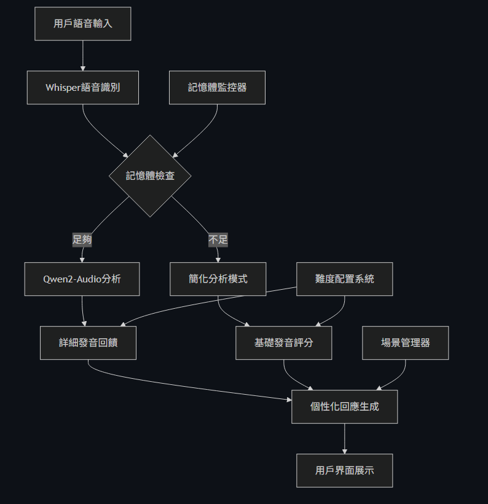
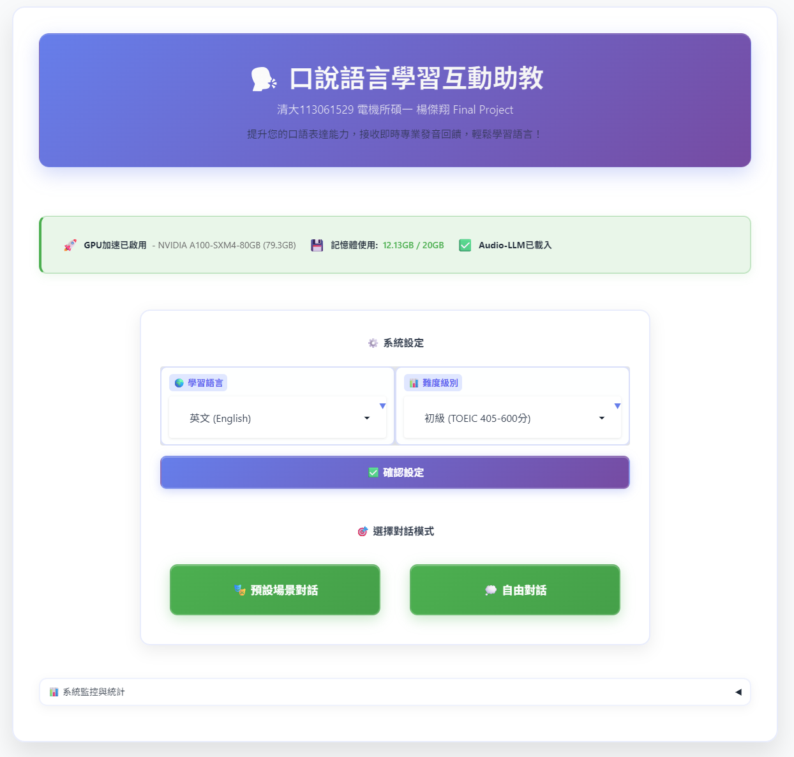
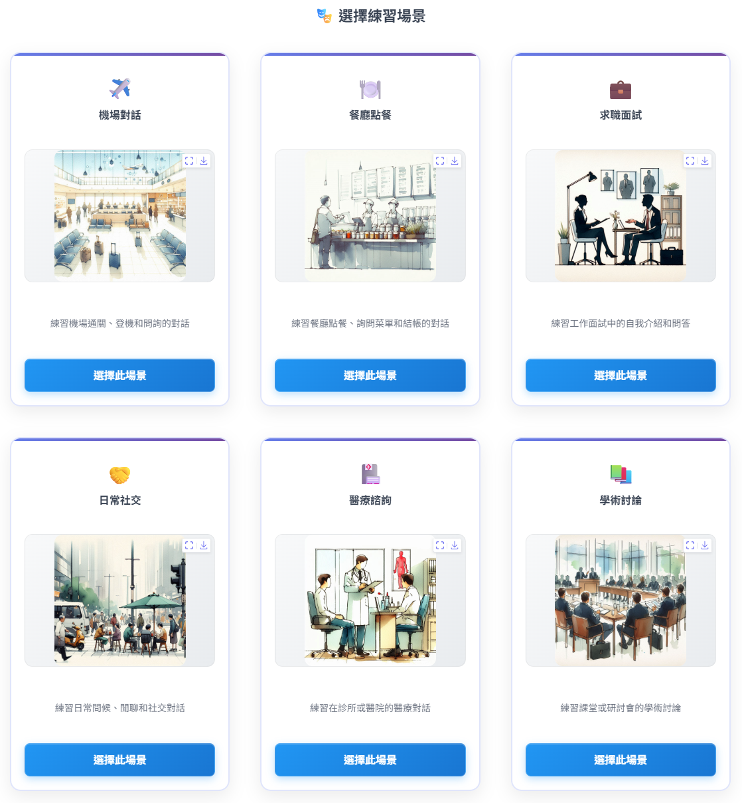
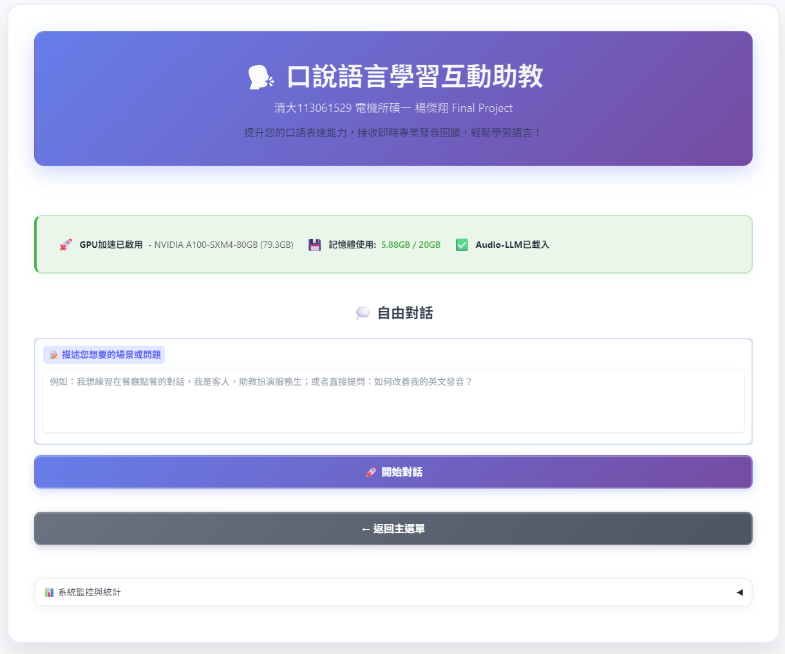
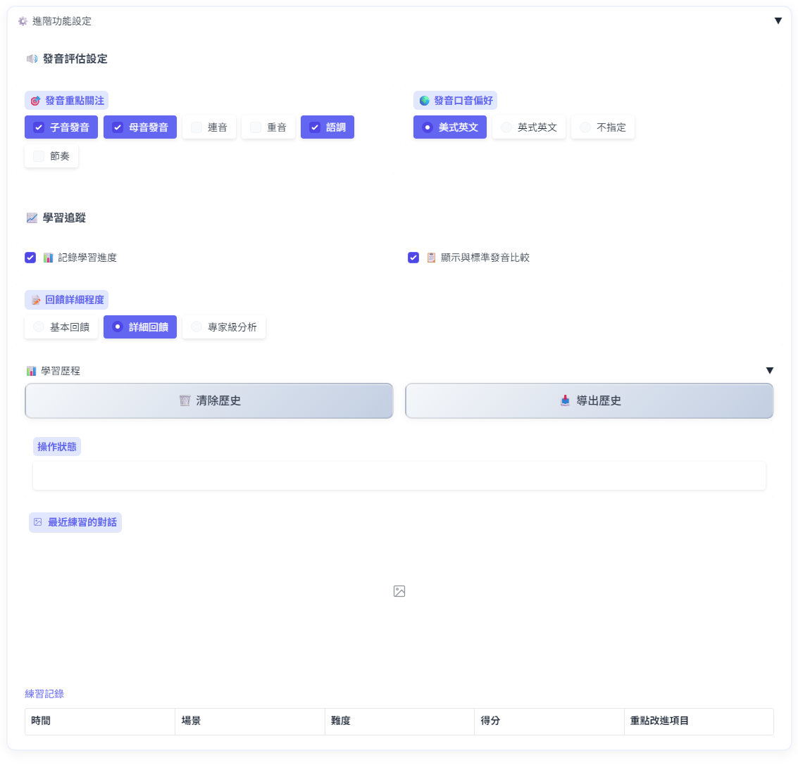

# 口說語言學習互動助教系統
## TAICA生成式AI課程期末專題報告

**學生資訊**
- **姓名**: 楊傑翔
- **學號**: 113061529
- **系所**: 國立清華大學電機工程學系碩士班
- **指導課程**: TAICA生成式AI：文字與圖像生成的原理與實務

---

## 1. 問題定義

### 1.1 背景說明

語言能力在學業及事業發展中扮演重要角色，然而口說能力的培養一直是語言學習者面臨的重大挑戰。傳統的語言學習環境存在多項結構性問題，限制了學習效果的提升。

### 1.2 核心問題分析

#### 1.2.1 課堂學習的侷限性

**個人化練習時間不足**：在傳統語言課堂中，每位學生的平均發言時間極為有限，通常不超過幾分鐘，無法提供充分的口說練習機會。

**即時回饋機制缺乏**：教師難以針對每位學生的發音給予詳細且即時的專業回饋，學生在私下練習時無法獲得準確的發音評估與改進建議。

**心理壓力障礙**：許多學習者在課堂環境中因擔心出錯而不敢開口，形成負面循環，進一步阻礙口說能力的發展。

**教學標準化問題**：課程進度和難度難以適應每位學生的個別需求和學習步調，且傳統教材偏重閱讀與語法，較少提供實際口說練習機會。

#### 1.2.2 實際應用需求落差

研究發現，留學環境能大幅提升語言能力的關鍵因素包括：沉浸式語言環境、實用導向的學習內容、即時真實的回饋機制，以及大量的重複練習機會。然而，傳統課堂學習環境無法提供這些關鍵要素。

#### 1.2.3 口說技能特殊挑戰

口說是語言學習中最複雜的技能之一，涉及多重認知過程的協調，包括：

- **發音準確度**：許多目標語言的音素在學習者母語中並不存在
- **語調和節奏**：不自然的語調嚴重影響溝通效果
- **心理障礙**：需要克服開口恐懼的心理阻礙
- **練習機會限制**：缺乏能耐心聆聽並提供專業回饋的對象
- **持續性動機**：單調的練習方式難以維持長期學習動力

### 1.3 問題定義總結

本專題旨在解決傳統語言學習環境中口說練習不足、即時回饋缺乏、個性化指導有限等核心問題，通過AI技術提供可隨時存取、個性化調整的智能語言學習助教系統。(而且不用錢錢!)

---

## 2. 現行方法優缺點分析

### 2.1 現有解決方案比較

| 解決方案類型 | 主要優點 | 核心限制 | 代表性產品 |
|-------------|----------|----------|------------|
| 語言學習App | 提供即時文法與文章練習回饋 | 常需付費解鎖完整內容，回饋以文字為主，缺乏語音糾正功能 | Duolingo, Babbel |
| 語言交換平台 | 提供與母語者直接交流機會 | 依賴他人在線意願，缺乏系統性訓練，專業回饋質量不一 | HelloTalk, Tandem |
| 傳統語言學習 | 提供專業教師指導和面對面互動 | 成本高昂，時間安排不靈活，無法提供無限制練習機會 | 補習班、家教 |

### 2.2 現有方案共同問題

#### 2.2.1 持續性回饋不足
大多數現有解決方案無法提供詳細且針對性的發音回饋，特別是在語音語調的細微差別識別方面。

#### 2.2.2 個性化程度有限
現有系統難以根據學習者的特定背景、發音困難點和學習進度提供客製化的指導內容。

#### 2.2.3 練習頻率受限
受到時間、成本或平台可用性的限制，學習者無法獲得充分的練習機會。

#### 2.2.4 互動性不足
多數解決方案提供單向練習，缺乏真實對話中的即時調整和應變能力培養。

#### 2.2.5 激勵機制薄弱
缺乏能持續推動學習者練習的有效激勵系統和進度追蹤機制。

---

## 3. 使用技術

### 3.1 Whisper 自動語音識別系統

#### 3.1.1 技術概述
OpenAI Whisper是一個基於Transformer架構的自動語音識別系統，經過68萬小時多語言和多任務監督數據訓練。本專題採用Whisper large-v3-turbo模型，該模型在準確性和推理速度之間實現了良好的平衡。

#### 3.1.2 核心技術特點

**多語言支援能力**：Whisper支援99種語言的語音識別，包括低資源語言，能夠處理多種口音和方言。

**強健性表現**：模型對背景噪音、音頻質量變化和說話風格具有良好的適應性，適合實際應用環境。

**端到端架構**：採用序列到序列的Transformer模型，能直接從音頻波形生成文字轉錄，無需複雜的前處理流程。

#### 3.1.3 技術實現細節

在本系統中，Whisper模型的載入採用智能降級機制：

```python
def _load_whisper_model(self):
    if self.use_gpu:
        self.whisper_model = whisper.load_model("medium").to(self.device)
        # 記憶體檢查，必要時降級到base模型
        if not self._memory_check_and_cleanup("Whisper載入後"):
            del self.whisper_model
            self.whisper_model = whisper.load_model("base").to(self.device)
```

### 3.2 Qwen2-Audio 多模態語言模型

#### 3.2.1 技術架構
Qwen2-Audio是阿里巴巴開發的大規模音頻語言模型，能夠理解語音內容並基於音頻輸入生成自然語言回應。該模型結合了語音理解和文本生成能力，支援多種音頻相關任務。

#### 3.2.2 核心技術優勢

**直接音頻理解**：模型能夠直接處理音頻信號，而不僅依賴文字轉錄，能夠捕捉語調、情感和語音細節。

**多模態整合**：結合音頻和文本信息，提供更準確和上下文相關的分析結果。

**可擴展性**：支援不同精度設定（float16/float32）和量化選項，適應不同硬體配置。

#### 3.2.3 實現策略

系統採用動態模型載入策略，根據可用GPU記憶體自動調整模型配置：

```python
if available_memory < 6:
    torch_dtype = torch.float32
    device_map = "cpu"
elif available_memory < 10:
    torch_dtype = torch.float16
    device_map = {"": 0}
else:
    torch_dtype = torch.float16
    device_map = "auto"
```

### 3.3 支援技術棧

#### 3.3.1 深度學習框架
- **PyTorch 2.0+**：提供高效的張量運算和GPU加速
- **Transformers 4.37+**：Hugging Face模型庫，簡化模型載入和推理
- **Accelerate**：分散式訓練和推理優化

#### 3.3.2 音頻處理工具
- **Librosa**：音頻分析和特徵提取
- **SoundFile**：音頻文件讀寫支援
- **NumPy**：數值計算基礎

#### 3.3.3 用戶界面技術
- **Gradio 4.44**：快速構建機器學習應用界面
- **自定義CSS**：現代化響應式設計

---

## 4. 解決方式

### 4.1 整體系統架構



#### 4.1.1 系統設計理念

本系統採用模組化設計架構，每個模組負責特定的技術領域，確保系統的可維護性和擴展性。
(簡單來說，怕用太多實驗室的資源所以要監控跟現制GPU的使用)

#### 4.1.2 核心架構組件

**模型管理層 (models.py)**
- 負責AI模型的載入、配置和生命週期管理
- 實現GPU/CPU自動檢測和智能降級機制
- 提供統一的模型訪問介面

**處理邏輯層 (processors.py)**
- 核心業務邏輯實現，包括語音處理和發音分析
- 實現基於難度的個性化評估算法
- 管理對話歷史和上下文

**資源監控層 (memory_monitor.py)**
- 實時系統資源監控和管理
- 自動記憶體清理和保護機制
- 系統穩定性保障

**使用者介面層 (app.py)**
- Gradio基礎的網頁應用界面
- 用戶交互邏輯和事件處理
- 界面狀態管理

#### 4.1.3 數據流架構

```
用戶語音輸入 → Whisper語音識別 → 記憶體狀態檢查 
                                        ↓
個性化回應生成 ← 發音評估處理 ← Qwen2-Audio分析/簡化分析
                                        ↓
用戶界面展示 ← 回饋內容整合 ← 難度調整處理
```

### 4.2 內部函數結構介紹

#### 4.2.1 ModelManager 類別結構

**初始化與配置管理**
```python
class ModelManager:
    def __init__(self, gpu_memory_limit=20):
        self._setup_gpu()              # GPU環境設定
        self._start_memory_monitoring() # 記憶體監控啟動
        self._load_models()            # 模型載入流程
```

**核心功能方法**
- `transcribe_audio()`: 語音識別主要介面
- `generate_audio_response()`: Audio-LLM回應生成
- `_memory_check_and_cleanup()`: 記憶體檢查與清理
- `clear_gpu_memory()`: GPU記憶體管理

#### 4.2.2 AudioProcessor 類別架構

**多層次分析方法**
```python
def analyze_pronunciation(self, audio_path, transcribed_text, 
                         scenario, conversation_history, difficulty):
    # 嘗試Audio-LLM詳細分析
    result = self._analyze_with_audio_llm(...)
    if result:
        return result
    # 降級使用簡化分析
    return self._analyze_with_simple_method(...)
```

**評分算法實現**
- `_calculate_pronunciation_score()`: 發音準確度評分
- `_calculate_fluency_score()`: 流暢度評估算法
- `_generate_difficulty_based_analysis()`: 基於難度的分析生成

#### 4.2.3 ConversationManager 對話管理

**完整處理流程**
```python
def process_user_input(self, audio_path, scenario, 
                      conversation_context, difficulty):
    # 語音識別
    recognized_text, status = self.audio_processor.transcribe_speech(audio_path)
    
    # 發音分析
    analysis_result = self.audio_processor.analyze_pronunciation(
        audio_path, recognized_text, scenario, conversation_context, difficulty
    )
    
    # 歷史記錄更新
    self._update_conversation_history(scenario, recognized_text, response_text)
```

#### 4.2.4 MemoryMonitor 監控系統

**多層次保護機制**
```python
def check_memory_usage(self):
    # GPU記憶體檢查
    for gpu_id, info in gpu_memory.items():
        if info["reserved"] > self.gpu_limit_gb:
            self.force_kill_program(reason)
    
    # CPU記憶體檢查
    if cpu_memory["process_usage"] > self.cpu_limit_gb:
        self.force_kill_program(reason)
```

### 4.3 特殊內容詳解

#### 4.3.1 智能難度調整系統

**TOEIC級別對應機制**

系統實現了基於TOEIC分數的五級難度系統，每個級別具有不同的評估標準和回饋風格：

```python
DIFFICULTY_CONFIGS = {
    "初學者 (TOEIC 250-400分)": {
        "evaluation_criteria": "Focus on basic pronunciation clarity",
        "encouragement_level": "very_encouraging",
        "score_adjustment": +15
    },
    # ... 其他級別配置
}
```

**動態評分調整**

評分系統根據學習者級別動態調整評分標準，確保評估的公平性和激勵性。初學者獲得更多鼓勵性評分調整，而高級學習者接受更嚴格的評估標準。

#### 4.3.2 記憶體管理與優化

**三階段保護機制**

1. **預警階段 (80%記憶體使用率)**
   - 發出記憶體使用警告
   - 執行自動垃圾回收
   - 調整模型精度設定

2. **保護階段 (90%記憶體使用率)**
   - 執行緊急記憶體清理
   - 模型卸載與重新載入
   - 啟用功能降級模式

3. **緊急階段 (95%+記憶體使用率)**
   - 強制終止程序執行
   - 自動保存重要數據
   - 記錄系統狀態資訊

**智能降級策略**

```python
def _load_qwen_audio_model(self):
    if available_memory < 6:
        # 使用CPU模式
        device_map = "cpu"
        torch_dtype = torch.float32
    elif available_memory < 10:
        # 使用量化模式
        torch_dtype = torch.float16
        device_map = {"": 0}
    else:
        # 完整GPU模式
        torch_dtype = torch.float16
        device_map = "auto"
```

#### 4.3.3 場景導向對話系統

**場景預設配置**

系統預定義六種常用對話場景，每種場景具有特定的角色設定、對話範本和評估重點：

- 機場對話：重點評估旅遊相關詞彙和基礎溝通能力
- 餐廳點餐：著重禮貌用語和服務互動表達
- 求職面試：評估專業詞彙和正式表達能力
- 日常社交：注重自然對話流暢度和慣用語使用
- 醫療諮詢：重點關注症狀描述的準確性
- 學術討論：評估學術詞彙和邏輯表達能力

**動態回應生成**

基於場景和難度級別，系統動態生成合適的回應內容：

```python
def get_scenario_responses(scenario, difficulty):
    if level in ["beginner", "elementary"]:
        # 使用簡單句型和基礎詞彙
        responses = simple_response_templates[scenario]
    elif level == "intermediate":
        # 使用中等複雜度表達
        responses = intermediate_response_templates[scenario]
    else:
        # 使用高級表達和專業詞彙
        responses = advanced_response_templates[scenario]
```

#### 4.3.4 現代化使用者界面設計

**響應式設計實現**

採用CSS Grid和Flexbox布局技術，實現跨設備的完美適配：

```css
.main-container {
    background: rgba(255, 255, 255, 0.98);
    backdrop-filter: blur(15px);
    border-radius: 20px;
    box-shadow: 0 20px 40px rgba(0, 0, 0, 0.1);
}

@media (max-width: 768px) {
    .main-container {
        margin: 10px;
        padding: 20px;
    }
}
```

**無障礙設計考慮**

- 高對比度配色方案
- 鍵盤導航支援
- 螢幕閱讀器相容性
- 清晰的視覺層次

---

## 5. 結果展示

### 5.1 系統功能展示

#### 5.1.1 主界面、語言與難度設定、場景選擇





### 5.2 對話練習功能

#### 5.2.1 預設場景對話


#### 5.2.2 發音分析與評分


#### 5.2.3 自由對話模式



### 5.3 進階功能展示

#### 5.3.1 進階設定與學習歷程



#### 5.3.2 系統監控介面


---

## 6. 結論與課程心得

### 6.1 專題成果總結

本次的Final Project開發了一個基於先進AI技術的智能語言學習助教系統，有效解決了傳統語言學習中口說練習不足、即時回饋缺乏等核心問題。系統整合Whisper語音識別和Qwen2-Audio多模態分析技術，提供個性化的發音評估和學習建議。

### 6.2 期末課程心得

本學期的課程涵蓋諸多內容，原本以為是單純從ML介紹到DL的課程，但每想到每一週老師都在給我們帶來新的東西，不管是開源的文生圖、LLM等資源，都讓我收益良多，而且老師也提供我們一個機會，讓我們幾乎可以說是最接近此時此刻AI時代的最前端，而本次的Final Project也是我和多個AI助教(GPT、Claude和Gemini)共同做出來的結果，結果看起來很不錯，有模有樣的，細看還是會看到很多痕跡，但還是讓我汲取不少成就感。整堂課程比我想像中的還要更加充實也更加實用，感謝助教跟教授帶來的課程，希望未來還能從老師手上學到更多東西。
