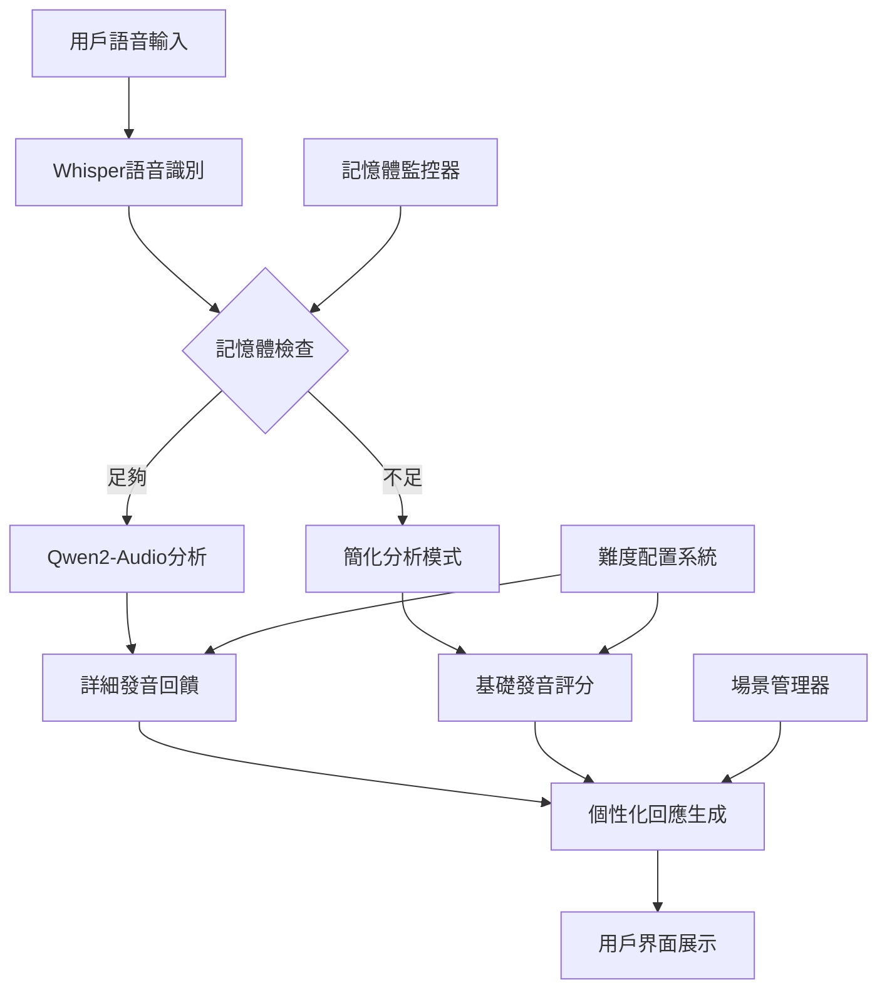
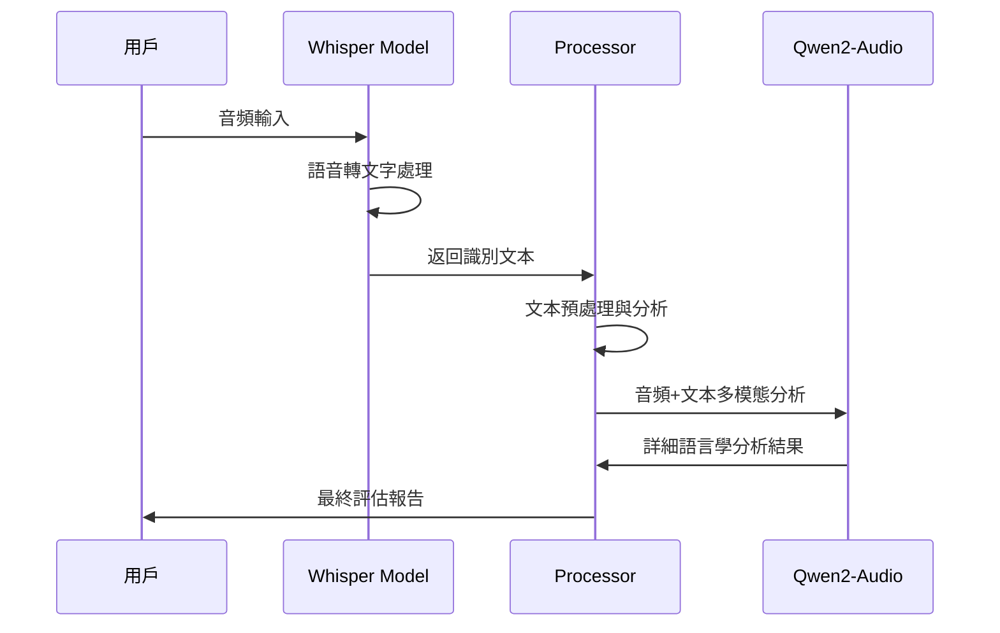

# 🗣️ 智能語言學習助教系統

**清華大學電機所 113061529 楊傑翔 Final Project**

> 基於 Whisper + Qwen2-Audio 的多模態語言學習平台，提供個性化發音評估與即時對話練習

[](https://python.org)
[](https://pytorch.org)
[](https://gradio.app)
[](LICENSE)

## 📋 目錄

- [✨ 專案亮點](#-專案亮點)
- [🎯 功能特色](#-功能特色)
- [🏗️ 系統架構](#️-系統架構)
- [📁 專案結構](#-專案結構)
- [🚀 快速開始](#-快速開始)
- [💻 系統需求](#-系統需求)
- [🔧 模組詳解](#-模組詳解)
- [📱 使用指南](#-使用指南)
- [⚙️ 高級配置](#️-高級配置)
- [🐛 故障排除](#-故障排除)
- [📊 性能優化](#-性能優化)
- [🤝 開發指南](#-開發指南)
- [📄 技術文檔](#-技術文檔)
- [🙏 致謝](#-致謝)

## ✨ 專案亮點

### 🧠 多模態AI架構
- **Whisper語音識別**: OpenAI頂級語音轉文字模型
- **Qwen2-Audio分析**: 阿里巴巴多模態語言模型，直接音頻理解
- **智能降級機制**: GPU記憶體不足時自動切換到CPU簡化模式

### 🎯 個性化學習體驗
- **5級難度系統**: 從初學者(TOEIC 250)到高級(TOEIC 905+)
- **6大場景模擬**: 機場、餐廳、面試、社交、醫療、學術
- **即時發音評分**: 綜合發音準確度與流暢度評估
- **智能回饋調整**: 基於學習者水平的個性化建議

### ⚡ 智能資源管理
- **動態記憶體監控**: 實時GPU/CPU使用量追蹤
- **自適應模型載入**: 根據硬體配置自動優化
- **緊急清理機制**: 防止記憶體溢出的保護措施

### 🎨 現代化UI設計
- **響應式界面**: 支援桌面端與行動裝置
- **毛玻璃效果**: 現代化視覺設計
- **無障礙支持**: 友善的用戶體驗設計

## 🎯 功能特色

### 📚 雙模式學習系統

#### 🎭 預設場景對話
```
✈️ 機場對話    - 通關、登機、護照檢查情境
🍽️ 餐廳點餐    - 點餐、詢問菜單、結帳對話  
💼 求職面試    - 工作面試問答與自我介紹
🤝 日常社交    - 問候、閒聊、社交互動
🏥 醫療諮詢    - 病情描述、醫療對話練習
📚 學術討論    - 課堂發言、研討會互動
```

#### 💭 自由對話模式
- 用戶自定義場景和話題
- 開放式對話練習
- 靈活的學習內容

### 🎧 多層次語音分析

#### 🔍 基礎分析 (簡化模式)
- 語音識別準確度評估
- 基本發音評分算法
- 流暢度統計分析

#### 🧠 進階分析 (Audio-LLM模式)
- 直接音頻內容理解
- 上下文相關的回饋
- 細緻的發音糾正建議

### 📊 個性化難度系統

| 難度級別 | TOEIC分數 | 評估標準 | 回饋特色 |
|---------|----------|----------|---------|
| 初學者 | 250-400 | 基礎發音清晰度 | 極度鼓勵性 (+15分調整) |
| 初級 | 405-600 | 基本對話流暢性 | 鼓勵性 (+10分調整) |
| 中級 | 605-780 | 語法準確度與自然度 | 平衡性 (標準評分) |
| 中高級 | 785-900 | 慣用語與細緻發音 | 建設性 (-5分調整) |
| 高級 | 905+ | 專業級流暢度 | 詳細分析 (-10分調整) |

### 🔧 進階功能設定

#### 🎯 發音重點關注
- **子音發音**: 清晰度與準確性
- **母音發音**: 音位準確度
- **連音技巧**: 自然語流處理
- **重音模式**: 單字與句子重音
- **語調變化**: 升降調與情感表達
- **節奏控制**: 語速與停頓

#### 🌍 口音偏好設定
- **美式英文**: General American發音標準
- **英式英文**: Received Pronunciation標準
- **彈性模式**: 不指定特定口音

#### 📈 學習追蹤功能
- **進度記錄**: 自動保存練習歷程
- **統計分析**: 發音改善趨勢圖表
- **歷史對比**: 與標準發音比較
- **匯出功能**: 學習記錄匯出

## 🏗️ 系統架構



### 🔄 智能降級機制

```python
# 自動模型選擇流程
if GPU_memory > 10GB:
    load_qwen2_audio_model(dtype=float16)
elif GPU_memory > 6GB:
    load_qwen2_audio_model(dtype=float16, quantized=True)
else:
    use_simplified_analysis_mode()
```

## 📁 專案結構

```
Qwen2-audio-TAICA-Final/
├── 📄 app.py                 # 主應用程式與Gradio界面
├── 🧠 models.py              # AI模型管理與GPU優化
├── ⚙️ processors.py          # 音頻處理與語言分析核心
├── 📊 memory_monitor.py      # 智能記憶體監控系統
├── 🎨 styles.css             # 現代化UI樣式設計
├── 📋 requirements.txt       # Python依賴套件清單
├── 📚 README.md              # 專案說明文檔
└── 📁 scenario_images/       # 場景配圖資源
    ├── airport.jpg           # 機場場景圖
    ├── restaurant.jpg        # 餐廳場景圖
    ├── interview.jpg         # 面試場景圖
    ├── socializing.jpg       # 社交場景圖
    ├── medical.jpg           # 醫療場景圖
    └── academic.jpg          # 學術場景圖
```

### 📂 核心模組職責

| 模組 | 主要功能 | 技術特色 |
|------|----------|----------|
| `models.py` | AI模型管理 | GPU自動檢測、記憶體優化、降級機制 |
| `processors.py` | 語音處理分析 | 多層次分析、難度調整、場景適配 |
| `app.py` | 用戶界面邏輯 | 響應式設計、事件處理、狀態管理 |
| `memory_monitor.py` | 系統監控 | 實時監控、自動清理、緊急保護 |
| `styles.css` | 視覺設計 | 毛玻璃效果、響應式布局、無障礙支持 |

## 🚀 快速開始

### 1️⃣ 環境設置

```bash
# 克隆專案
git clone <your-repo-url>
cd Qwen2-audio-TAICA-Final

# 創建虛擬環境
conda create --name language_assistant python=3.10
conda activate language_assistant

# 安裝PyTorch (CUDA版本)
conda install pytorch torchvision torchaudio pytorch-cuda=11.8 -c pytorch -c nvidia

# 安裝其他依賴
pip install -r requirements.txt
```

### 2️⃣ 模型準備

```bash
# 自動下載模型 (首次運行時)
python models.py

# 或手動下載 (可選)
huggingface-cli download openai/whisper-medium
huggingface-cli download Qwen/Qwen2-Audio-7B-Instruct
```

### 3️⃣ 啟動應用

```bash
# 基本啟動
python app.py

# 指定GPU記憶體限制 (預設20GB)
GPU_MEMORY_LIMIT=16 python app.py

# CPU模式 (無GPU時)
CUDA_VISIBLE_DEVICES="" python app.py
```

### 4️⃣ 訪問界面

- **本地訪問**: http://localhost:7861
- **網路分享**: 啟動時會自動生成 Gradio 分享連結
- **支援設備**: 桌面瀏覽器、平板、手機

## 💻 系統需求

### 🟢 最低配置

| 組件 | 需求 | 說明 |
|------|------|------|
| **Python** | 3.10+ | 支援最新語言特性 |
| **記憶體** | 8GB RAM | 基本模型載入需求 |
| **儲存空間** | 15GB 可用空間 | 模型檔案約10GB |
| **網路** | 寬頻連線 | 首次下載模型需要 |
| **音頻設備** | 麥克風 | 錄音功能必需 |

### ⭐ 建議配置

| 組件 | 建議規格 | 性能提升 |
|------|----------|----------|
| **GPU** | RTX 4070 / RTX 3080 (8GB+ VRAM) | 10-20x 加速 |
| **記憶體** | 16GB+ RAM | 更好的多工處理 |
| **CPU** | 8核心+ 現代處理器 | CPU降級模式性能 |
| **儲存** | SSD 固態硬碟 | 更快的模型載入 |
| **音頻** | 高品質USB麥克風 | 更好的語音識別 |

### 🔧 GPU支援情況

| GPU型號 | VRAM | Audio-LLM支援 | 推薦設定 |
|---------|------|---------------|----------|
| RTX 4090 | 24GB | ✅ 完全支援 | float16, 全功能 |
| RTX 4080 | 16GB | ✅ 完全支援 | float16, 全功能 |
| RTX 4070 | 12GB | ✅ 完全支援 | float16, 建議限制18GB |
| RTX 3080 | 10GB | ⚠️ 部分支援 | float16, 量化模式 |
| RTX 3070 | 8GB | ⚠️ 基礎支援 | 簡化模式 |
| GTX 1660 | 6GB | ❌ CPU降級 | Whisper only |

## 🔧 模組詳解

### 🧠 models.py - AI模型管理中心

```python
class ModelManager:
    """
    統一管理所有AI模型，包含：
    - GPU/CPU自動檢測與配置
    - Whisper語音識別模型載入
    - Qwen2-Audio多模態模型管理
    - 智能記憶體優化與監控
    """
```

#### 核心特性
- **自適應硬體檢測**: 自動識別最佳GPU配置
- **記憶體安全機制**: 防止OOM錯誤的多層保護
- **模型熱切換**: 運行時動態調整模型精度
- **資源清理**: 智能垃圾回收與記憶體釋放

### ⚙️ processors.py - 語音處理與分析核心

```python
class AudioProcessor:
    """
    處理語音分析的核心邏輯：
    - 多層次語音識別與理解
    - 基於難度的評分調整算法
    - 個性化回饋內容生成
    - 上下文感知的對話管理
    """
```

#### 分析層次架構

1. **語音識別層** (Whisper)
   - 高精度語音轉文字
   - 多語言支援能力
   - 雜音環境適應

2. **語義理解層** (Qwen2-Audio)  
   - 直接音頻內容分析
   - 語調情感識別
   - 發音細節評估

3. **評分調整層** (Difficulty-Aware)
   - 基於TOEIC級別的動態評分
   - 學習者進度追蹤
   - 個性化建議生成

### 📊 memory_monitor.py - 智能資源監控

```python
class MemoryMonitor:
    """
    實時系統資源監控：
    - GPU記憶體使用追蹤
    - CPU資源監控
    - 自動緊急清理機制
    - 進程保護與恢復
    """
```

#### 保護機制層級

1. **預警階段** (80% 使用率)
   - 記憶體使用警告
   - 自動垃圾回收
   - 模型精度調整

2. **保護階段** (90% 使用率)
   - 緊急記憶體清理
   - 模型卸載重載
   - 功能降級處理

3. **緊急階段** (95%+ 使用率)
   - 強制程序終止
   - 數據自動保存
   - 系統狀態記錄

### 🎨 styles.css - 現代化UI設計系統

#### 設計語言特色

- **毛玻璃擬態設計**: `backdrop-filter: blur()` 現代視覺效果
- **漸層配色方案**: 豐富的顏色層次與品牌一致性
- **響應式布局**: 跨設備完美適配
- **無障礙支持**: WCAG 2.1 標準遵循

```css
/* 核心設計系統 */
.main-container {
    background: rgba(255, 255, 255, 0.98);
    backdrop-filter: blur(15px);
    border: 2px solid rgba(102, 126, 234, 0.15);
    border-radius: 20px;
    box-shadow: 
        0 20px 40px rgba(0, 0, 0, 0.1),
        inset 0 1px 0 rgba(255, 255, 255, 0.8);
}
```

## 📱 使用指南

### 🎯 預設場景模式操作流程

#### 1. 系統設定
```
1️⃣ 選擇學習語言 (目前支援英文)
2️⃣ 設定難度級別 (TOEIC 250-905+)  
3️⃣ 確認設定並選擇模式
```

#### 2. 場景選擇
```
✈️ 機場對話 - 護照檢查、登機程序
🍽️ 餐廳點餐 - 菜單詢問、點餐結帳  
💼 求職面試 - 自我介紹、問答互動
🤝 日常社交 - 問候閒聊、社交對話
🏥 醫療諮詢 - 症狀描述、醫療溝通
📚 學術討論 - 課堂發言、學術交流
```

#### 3. 對話練習
```
🎤 點擊麥克風圖標開始錄音
🔴 說出您的回應 (建議5-15秒)
⏹️ 停止錄音並等待分析
📊 查看詳細發音評估與建議
🔄 根據建議進行改進練習
```

### 💭 自由對話模式

#### 自定義場景示例

```markdown
# 商務會議場景
"我想練習在國際商務會議中發言，
包括提出建議、表達意見和詢問問題的對話。"

# 旅遊諮詢場景  
"模擬在旅遊服務中心詢問景點資訊、
交通方式和住宿建議的對話。"

# 學術研討場景
"練習在學術研討會中提問、
回應他人觀點並進行專業討論。"
```

### 🔧 進階功能使用

#### 發音重點關注設定

```python
# 子音發音重點
focus_areas = [
    "th音 (think, that)",
    "r/l區別 (right, light)", 
    "v/w區別 (very, worry)",
    "清濁音對比 (pat, bat)"
]

# 語調練習重點
intonation_focus = [
    "疑問句上升調",
    "陳述句下降調", 
    "強調語調變化",
    "情感表達語調"
]
```

#### 學習追蹤功能

- **練習歷程**: 自動記錄每次練習的時間、場景、得分
- **進步趨勢**: 圖表化顯示發音改善軌跡  
- **弱項分析**: AI識別需要加強的發音要點
- **目標設定**: 根據TOEIC級別設定學習目標

## ⚙️ 高級配置

### 🚀 性能調優參數

```python
# models.py 中的關鍵配置
GPU_MEMORY_LIMIT = 20  # GPU記憶體限制 (GB)
CHECK_INTERVAL = 3     # 記憶體檢查間隔 (秒)
WHISPER_MODEL_SIZE = "medium"  # base/small/medium/large
AUDIO_LLM_PRECISION = "float16"  # float32/float16

# processors.py 中的分析參數  
SCORE_ADJUSTMENT_RANGE = (-10, +15)  # 難度調整範圍
ANALYSIS_DETAIL_LEVELS = 3  # 回饋詳細程度
CONVERSATION_HISTORY_LIMIT = 10  # 對話歷史保留數量
```

### 🔧 環境變數配置

```bash
# GPU設定
export CUDA_VISIBLE_DEVICES="0"          # 指定GPU
export PYTORCH_CUDA_ALLOC_CONF="max_split_size_mb:512"

# 模型路徑 (可選)
export WHISPER_CACHE_DIR="/path/to/whisper/models"
export HF_HOME="/path/to/huggingface/cache"

# 記憶體限制
export GPU_MEMORY_LIMIT="16"             # GPU記憶體限制(GB)
export CPU_MEMORY_LIMIT="32"             # CPU記憶體限制(GB)

# 應用設定
export GRADIO_SERVER_PORT="7861"         # 服務端口
export GRADIO_SHARE="true"               # 是否產生分享連結
```

### 📊 監控與日誌配置

```python
# 啟用詳細日誌
import logging
logging.basicConfig(
    level=logging.INFO,
    format='%(asctime)s - %(name)s - %(levelname)s - %(message)s',
    handlers=[
        logging.FileHandler('language_assistant.log'),
        logging.StreamHandler()
    ]
)

# 記憶體監控自定義
monitor = MemoryMonitor(
    gpu_limit_gb=18,      # 自定義GPU限制
    cpu_limit_gb=24,      # 自定義CPU限制  
    check_interval=2      # 更頻繁的檢查
)
```

## 🐛 故障排除

### ❗ 常見問題解決方案

#### 1. 模型載入失敗

```bash
# 問題: 網路下載超時
解決方案:
1. 檢查網路連線穩定性
2. 使用代理或VPN (如果需要)
3. 手動下載模型文件

# 手動下載指令
huggingface-cli download --resume-download openai/whisper-medium
huggingface-cli download --resume-download Qwen/Qwen2-Audio-7B-Instruct
```

#### 2. GPU記憶體不足

```python
# 問題: torch.cuda.OutOfMemoryError
解決方案:
1. 降低GPU_MEMORY_LIMIT設定
2. 關閉其他GPU程序
3. 使用CPU模式

# 強制CPU模式
CUDA_VISIBLE_DEVICES="" python app.py
```

#### 3. 音頻識別錯誤

```bash
# 問題: 麥克風無法錄音
解決方案:
1. 檢查瀏覽器麥克風權限
2. 測試麥克風硬體功能  
3. 確認音頻格式支援

# 瀏覽器權限設定
Chrome: 設定 > 隱私權和安全性 > 網站設定 > 麥克風
Firefox: 偏好設定 > 隱私權與安全性 > 權限 > 麥克風
```

#### 4. 界面顯示異常

```bash
# 問題: CSS樣式未載入
解決方案:
1. 確認 styles.css 文件存在
2. 檢查文件權限設定
3. 清除瀏覽器緩存

# 檢查文件
ls -la styles.css
# 應該顯示文件存在且可讀取
```

### 🔍 調試模式啟用

```python
# 啟用詳細調試信息
debug_mode = True

if debug_mode:
    # 1. 模型載入狀態
    print("模型管理器狀態:", model_manager.get_device_info())
    
    # 2. 記憶體使用情況
    print("記憶體狀態:", model_manager.get_memory_status())
    
    # 3. 處理器配置
    print("處理器設定:", processor.get_config())
    
    # 4. Gradio除錯模式
    demo.launch(debug=True, show_error=True)
```

### 📋 系統診斷指令

```bash
# GPU檢測
nvidia-smi
python -c "import torch; print(f'CUDA可用: {torch.cuda.is_available()}')"

# 記憶體檢測  
free -h
python -c "import psutil; print(f'可用記憶體: {psutil.virtual_memory().available/1024**3:.1f}GB')"

# Python環境檢測
python --version
pip list | grep -E "(torch|transformers|gradio|whisper)"

# 模型文件檢測
find ~/.cache/huggingface -name "*whisper*" -type d
find ~/.cache/huggingface -name "*Qwen2-Audio*" -type d
```

## 📊 性能優化

### ⚡ 運行速度優化

#### 1. GPU加速配置

```python
# 最佳GPU設定
torch.backends.cudnn.benchmark = True    # 加速卷積運算
torch.backends.cudnn.deterministic = False  # 提升性能
torch.set_float32_matmul_precision('high')   # 混合精度運算

# 模型優化
model.half()  # 使用float16精度
model.eval()  # 評估模式
torch.no_grad()  # 關閉梯度計算
```

#### 2. 記憶體使用優化

```python
# 記憶體管理策略
BATCH_SIZE = 1                    # 單批次處理
MAX_AUDIO_LENGTH = 30            # 限制音頻長度(秒)
CACHE_SIZE_LIMIT = 100           # 緩存項目限制
GARBAGE_COLLECTION_INTERVAL = 5  # GC間隔(次)

# 自動記憶體清理
def auto_cleanup():
    if torch.cuda.is_available():
        torch.cuda.empty_cache()
    gc.collect()
```

#### 3. 並行處理優化

```python
# 多線程設定
torch.set_num_threads(4)              # CPU線程數
os.environ["OMP_NUM_THREADS"] = "4"   # OpenMP線程

# 異步處理
import asyncio
async def process_audio_async(audio_path):
    # 非阻塞音頻處理
    pass
```

### 📈 性能監控指標

```python
import time
import psutil

class PerformanceMonitor:
    def __init__(self):
        self.start_time = time.time()
        self.process = psutil.Process()
    
    def get_metrics(self):
        return {
            "運行時間": time.time() - self.start_time,
            "CPU使用率": self.process.cpu_percent(),
            "記憶體使用": self.process.memory_info().rss / 1024**2,
            "GPU記憶體": torch.cuda.memory_allocated() / 1024**2 if torch.cuda.is_available() else 0
        }
```

### 🎯 模型效能調節

| 設定項目 | 高性能 | 平衡 | 省資源 |
|---------|--------|------|---------|
| Whisper模型 | large | medium | base |
| 音頻LLM精度 | float16 | float16 | float32(CPU) |
| 批次大小 | 4 | 1 | 1 |
| 記憶體限制 | 24GB | 16GB | 8GB |
| 回饋詳細度 | 專家級 | 詳細 | 基本 |

## 🤝 開發指南

### 🔧 擴展功能開發

#### 1. 新增語言支援

```python
# processors.py 中添加新語言
SUPPORTED_LANGUAGES = {
    "英文": "en",
    "中文": "zh",  # 新增中文支援
    "日文": "ja",  # 新增日文支援
    "韓文": "ko"   # 新增韓文支援
}

# 為新語言配置Whisper
def transcribe_multilingual(audio_path, language):
    return whisper_model.transcribe(
        audio_path, 
        language=SUPPORTED_LANGUAGES[language],
        temperature=0.0
    )
```

#### 2. 自定義場景開發

```python
# 在 processors.py 中新增場景
def add_custom_scenario(scenario_name, prompt_template, responses):
    """
    新增自定義場景
    
    Args:
        scenario_name: 場景名稱
        prompt_template: 場景提示模板
        responses: 場景回應列表
    """
    SCENARIO_PROMPTS[scenario_name] = prompt_template
    SCENARIO_RESPONSES[scenario_name] = responses

# 使用範例
add_custom_scenario(
    "銀行服務 (Banking)",
    """You are a bank teller helping a customer with {level} English proficiency.
    Provide appropriate assistance and evaluate their banking vocabulary usage.""",
    [
        "How can I help you today?",
        "What type of account would you like to open?",
        "Please provide your identification.",
        "Your transaction has been completed."
    ]
)
```

#### 3. 評分算法客製化

```python
class CustomScoringAlgorithm:
    """自定義評分算法基類"""
    
    def calculate_pronunciation_score(self, audio_features, text_content, difficulty):
        """
        計算發音分數
        
        Args:
            audio_features: 音頻特徵數據
            text_content: 識別文本內容  
            difficulty: 難度級別
            
        Returns:
            int: 發音分數 (0-100)
        """
        base_score = self._analyze_audio_quality(audio_features)
        text_bonus = self._analyze_text_complexity(text_content)
        difficulty_adjustment = self._get_difficulty_modifier(difficulty)
        
        return min(100, max(0, base_score + text_bonus + difficulty_adjustment))
    
    def _analyze_audio_quality(self, features):
        """分析音頻品質"""
        # 實現音頻品質分析邏輯
        pass
    
    def _analyze_text_complexity(self, text):
        """分析文本複雜度"""
        # 實現文本複雜度分析
        pass
```

#### 4. UI組件擴展

```python
# 在 app.py 中新增自定義組件
def create_advanced_feedback_panel():
    """創建進階回饋面板"""
    with gr.Column(elem_classes="advanced-feedback-panel") as panel:
        # 發音熱力圖
        pronunciation_heatmap = gr.Plot(
            label="🔥 發音熱力圖",
            show_label=True
        )
        
        # 語調曲線圖
        intonation_curve = gr.Plot(
            label="📈 語調分析曲線", 
            show_label=True
        )
        
        # 對比分析
        comparison_chart = gr.BarPlot(
            label="📊 與標準發音對比",
            x="發音要素",
            y="相似度分數"
        )
    
    return panel, pronunciation_heatmap, intonation_curve, comparison_chart
```

### 🧪 測試框架

#### 1. 單元測試

```python
# tests/test_models.py
import unittest
from models import ModelManager

class TestModelManager(unittest.TestCase):
    def setUp(self):
        self.model_manager = ModelManager(gpu_memory_limit=8)
    
    def test_device_detection(self):
        """測試設備檢測功能"""
        device_info = self.model_manager.get_device_info()
        self.assertIn('device', device_info)
        self.assertIn('use_gpu', device_info)
    
    def test_whisper_transcription(self):
        """測試Whisper語音識別"""
        # 使用測試音頻文件
        result = self.model_manager.transcribe_audio("test_audio.wav")
        self.assertIsNotNone(result)
        self.assertIsInstance(result, str)
    
    def tearDown(self):
        self.model_manager.clear_gpu_memory()

# 運行測試
python -m pytest tests/ -v
```

#### 2. 集成測試

```python
# tests/test_integration.py
import gradio as gr
from app import demo

def test_gradio_interface():
    """測試Gradio界面集成"""
    # 測試界面啟動
    assert demo is not None
    
    # 測試主要功能
    inputs = ["test_audio.wav", "英文", "中級"]
    outputs = demo.process(inputs)
    assert len(outputs) > 0

def test_end_to_end_workflow():
    """端到端工作流程測試"""
    from processors import get_conversation_manager
    
    manager = get_conversation_manager()
    result = manager.process_user_input(
        "test_audio.wav",
        "機場對話 (Airport Conversation)",
        "",
        "中級 (TOEIC 605-780分)"
    )
    
    assert result["success"] == True
    assert "recognized_text" in result
    assert "pronunciation_score" in result
```

#### 3. 性能測試

```python
# tests/test_performance.py
import time
import memory_profiler

@memory_profiler.profile
def test_memory_usage():
    """測試記憶體使用情況"""
    from models import get_model_manager
    
    manager = get_model_manager()
    
    # 連續處理測試
    for i in range(10):
        result = manager.transcribe_audio(f"test_audio_{i}.wav")
        assert result is not None

def test_response_time():
    """測試回應時間"""
    from processors import get_conversation_manager
    
    manager = get_conversation_manager()
    
    start_time = time.time()
    result = manager.process_user_input(
        "test_audio.wav", 
        "日常社交",
        "",
        "中級"
    )
    end_time = time.time()
    
    response_time = end_time - start_time
    assert response_time < 10.0  # 應在10秒內完成
    print(f"回應時間: {response_time:.2f}秒")
```

## 📄 技術文檔

### 🔬 核心演算法說明

#### 1. 語音識別流程



#### 2. 難度調整算法

```python
def calculate_difficulty_adjusted_score(base_score, difficulty_level, user_progress):
    """
    基於難度和用戶進度的動態評分算法
    
    Formula:
    adjusted_score = base_score + difficulty_modifier + progress_bonus + encouragement_factor
    """
    
    # 難度調整係數
    difficulty_modifiers = {
        "初學者": +15,    # 更鼓勵的評分
        "初級": +10,      # 適度鼓勵
        "中級": 0,        # 標準評分
        "中高級": -5,     # 更嚴格標準
        "高級": -10       # 專業級標準
    }
    
    # 進步獎勵係數
    progress_bonus = min(10, user_progress.improvement_rate * 5)
    
    # 鼓勵因子 (避免連續低分打擊信心)
    encouragement_factor = 0
    if user_progress.recent_low_scores >= 3:
        encouragement_factor = 8
    
    return min(100, max(40, 
        base_score + 
        difficulty_modifiers.get(difficulty_level, 0) + 
        progress_bonus + 
        encouragement_factor
    ))
```

## 📞 聯絡資訊

### 👨‍🎓 專案作者
- **姓名**: 楊傑翔
- **學號**: 113061529  
- **系所**: 清華大學電機工程學系碩士班
- **學年**: 113學年度

### 📧 聯絡方式
- **學校信箱**: [s113061529@m113.nthu.edu.tw](mailto:s113061529@m113.nthu.edu.tw)
- **專案GitHub**: [待補充]
- **技術部落格**: [待補充]

---

<div align="center">

### 🎉 感謝使用智能語言學習助教系統！

**讓AI成為您語言學習路上的最佳夥伴** 🚀

[](https://web.ee.nthu.edu.tw/)
[](https://python.org)
[](https://openai.com)

**Happy Learning! 📚✨**

</div>